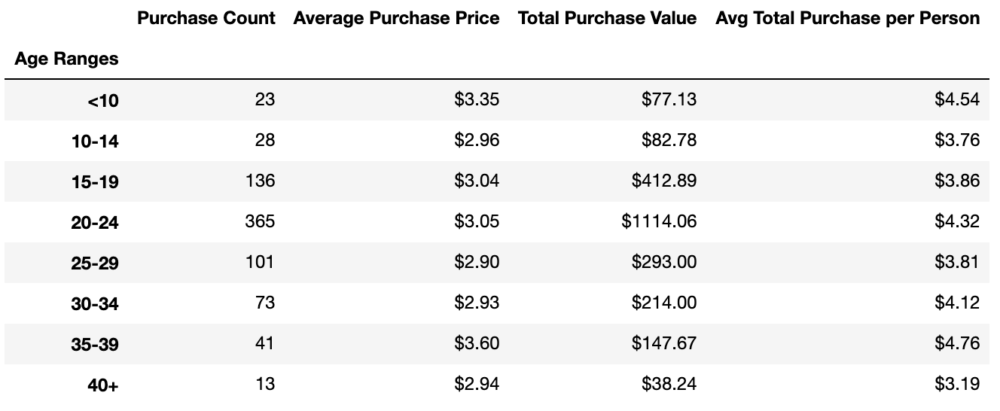

# pandas-challenge

# Heroes of Pymoli

---

Worked on Heroes of Pymoli to generate the following report:

### Player Count
* Total Number of Players

Output:

### Purchasing Analysis (Total)
* Number of Unique Items
* Average Purchase Price
* Total Number of Purchases
* Total Revenue

Output:

### Gender Demographics
* Percentage and Count of Male Players
* Percentage and Count of Female Players
* Percentage and Count of Other / Non-Disclosed

Output:

### Purchasing Analysis (Gender)
* The below each broken by gender
    * Purchase Count
    * Average Purchase Price
    * Total Purchase Value
    * Average Purchase Total per Person by Gender

Output:
   

### Age Demographics
* The below each broken into bins of 4 years (i.e. <10, 10-14, 15-19, etc.)
    * Total Count
    * Percentage of Players
    
Output:
   

### Purchasing Analysis (Age)
* The below each broken into bins of 4 years (i.e. <10, 10-14, 15-19, etc.)
    * Purchase Count
    * Average Purchase Price
    * Total Purchase Value
    * Average Purchase Total per Person by Age Group

Output:
 

### Top Spenders
* Identify the the top 5 spenders in the game by total purchase value, then list (in a table):
    * SN
    * Purchase Count
    * Average Purchase Price
    * Total Purchase Value

Output:
   

### Most Popular Items
* Identify the 5 most popular items by purchase count, then list (in a table):
    * Item ID
    * Item Name
    * Purchase Count
    * Item Price
    * Total Purchase Value

Output:
   

### Most Profitable Items
* Identify the 5 most profitable items by total purchase value, then list (in a table):
    * Item ID
    * Item Name
    * Purchase Count
    * Item Price
    * Total Purchase Value

Output:
   

### Analysis
(can also be found in Trends.txt)
Heroes of Pymoli Observable Trends: 

* Male players make up the majority of the fantasy game Heroes of Pymoli players, over 80%.

* On average, per player, female and non-disclosed payers spent slightly more than Male players. However, due to the number of Male players, they spent the most money on the game($1,967.64), far outweighing the female($361.94) and other/non-disclosed players($50.19).

* The majority of players are in the 20-24 age group who also had the highest Total purchase per age group, spending an average of $4.32 per person. This was followed by the 15-19 age group.

* ‘Final Critic’ and ‘Oathbreaker, Last Hope of the Breaking Storm’ are the 2 most popular and most profitable games.

* Marketing should be targetted towards Males in the 20-24 age group. ‘Final Critic’ and ‘Oathbreaker, Last Hope of the Breaking Storm’ should be promoted as best sellers since they are the most popular and prfitable games